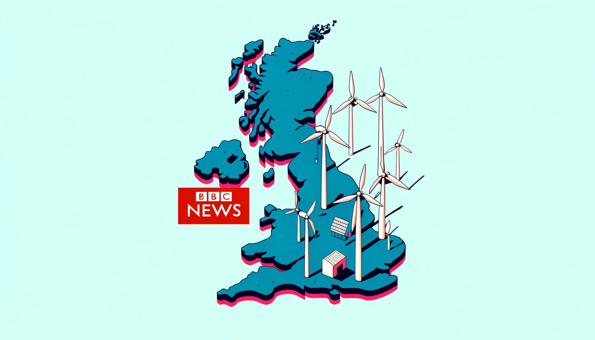

# Investigation of the Impact of Economic and Social Factors on Energy Demand through Natural Language Processing



## Abstract

The relationship between energy demand and variables such as economic activity and weather is well established. 
However, this paper aims to explore the connection between energy demand and other social aspects, which receives little attention. 
Through the use of natural language processing on a large news corpus, we shed light on this important link.
This study was carried out in five regions of the UK and Ireland and considers multiple horizons from 1 to 30 days. 
It also considers economic variables such as GDP, unemployment and inflation.
We found that: 1) News about military conflicts, transportation, the global pandemic, regional economics, and the international energy market are related to electricity demand. 
2) Economic indicators are more important in the East Midlands and Northern Ireland, while social indicators are more useful in the West Midlands and the South West of England. 
3) The use of these indices improved forecasting performance by up to 9%.


## Requirement:
```
* Python 3.8.18
* numpy 1.24.3
* pandas 2.0.3
* lightgbm 4.1.0
* optuna 3.5.0
* matplotlib 3.7.2
* shap 0.44.1
```

## Data Preparation

Data can be downloaded from https://drive.google.com/drive/folders/1M7UxDt49zfwLL6X9d7bsuCwWXIqW6-wD?usp=share_link.

```
* loadData: a folder with the preprocessed hourly regional electricity demand data and features.
* Ecodata.csv: GDP, unemployment, inflation in the UK, for regions: East Midlands, West Midlands, South West, South Wales, Northern Ireland.
* Ecodata-Ireland.csv: GDP, unemployment, inflation in the Ireland.
* text_features.csv: daily full-text features extracted from the BBC News raw text from 2020-06-01 to 2023-06-30, including classes of: counting, word frequencies, sentiments, topics, and GloVe word embeddings.
* hier_clusters_feat.pkl: grouped text features by hierarchical clustering
```

## Train and Evaluate models

We designed four forecasting tasks of 'noText_noEco', 'noText_withEco', 'withText_noEco', 'withText_withEco' according to the participating of text or economic features. By selecting the region and specific task, the user can train and evaluate the lightGBM model. We also offer the analysis of SHAP values by plotting the beeswarm, dependency, and feature importance across all the horizons.
